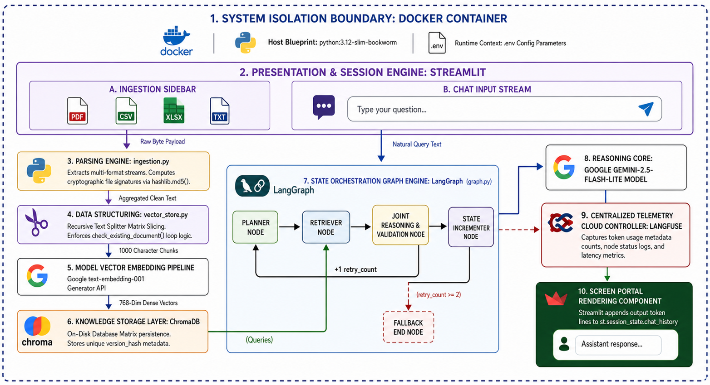

# Technical Submission Documentation
## System Architecture, Multi-Agent Operations & Evaluation Report

**Project Name:** Capstone-Gen-AI-Agentic-AI-Project  
**Context:** Generative AI & Agentic AI Application  
**Target Environment:** Docker Containerized / Local Streamlit Deployment  

---

## 🏗️ 1. System Architecture Overview

This application implements an enterprise-grade Retrieval-Augmented Generation (RAG) system orchestrated by an advanced multi-agent state network. The primary objective is to allow users to securely ingest diverse enterprise documentation and query it using autonomous AI agents that reason, fact-check, and self-correct within strict token and loop boundaries.

### Component Map & Data Lifecycles
1. **User Interface Layer (`main.py`)**: A Streamlit web application running a sliding-window message limit to prevent browser lag, handling file upload streams, conversational history, and interactive agent diagnostic tracers.
2. **Configuration Engine (`app/core/config.py`)**: A self-validating environment broker built with Pydantic Settings (`v2.13.4`) that handles local paths and cloud analytics keys from `.env`.
3. **Multi-Format Ingestion Processor (`app/services/ingestion.py`)**: A modular data parsing hub leveraging `PyPDF2` and `pandas` to isolate text matrices from PDF, TXT, CSV, XLSX, JSON, and YAML formats. It executes a deterministic cryptographic hashing pipeline (MD5) directly over raw incoming file byte streams to extract a unique document version signature used to enforce system-wide indexing compliance.
4. **Vector Storage Layer (`app/services/vector_store.py`)**: Houses the text chunker splitter (1000 size, 150 overlap) and interfaces persistently with local `ChromaDB` storage utilizing Google's modern `gemini-embedding-001` framework (3072 dimensions).
5. **Multi-Agent Orchestration Graph (`app/agents/graph.py`)**: Houses the text chunker splitter (1000 size, 150 overlap) and interfaces persistently with local `ChromaDB` storage utilizing Google's modern `gemini-embedding-001` framework (3072 dimensions). It evaluates stored segment metadata filters via a custom `check_existing_document` abstraction layer to identify file duplicates, short-circuiting vector routines if signatures match or cleanly purging outdated document chunks using internal tracking IDs before updating records

## System Architecture Diagram


---

## 🤖 2. Autonomous Agent Roles & Bounded State Workflows

The framework relies on a centralized state dictionary layout (`AgentState`) passed sequentially between specialized AI processing nodes. Every reasoning step is driven by **Google Gemini-2.5-Flash-Lite** with temperature settings locked at `0.0` to force factual correctness.

```text
       [ User Enters Natural Language Query via Streamlit ]
                               │
                               ▼
                    ┌─────────────────────┐
                    │     entry_router    │ (Conditional Screening)
                    └─────────────────────┘
                               │
         ┌─────────────────────┴─────────────────────┐
         ▼ (If Casual Greeting)                      ▼ (If Operational Query)
┌───────────────────────┐                  ┌───────────────────────┐
│  casual_response_node │                  │     planner_node      │ ◄─────────┐
└───────────────────────┘                  └───────────────────────┘           │
         │                                           │                         │
         │                                           ▼                         │
         │                                 ┌───────────────────────┐           │
         │                                 │    retriever_node     │           │
         │                                 └───────────────────────┘           │
         │                                           │                         │
         │                                           ▼                         │
         │                                 ┌───────────────────────┐           │
         │                                 │  joint_reasoning_and  │           │
         │                                 │   _validation_node    │           │
         │                                 └───────────────────────┘           │
         │                                           │                         │
         │                                           ▼                         │
         │                                 ┌───────────────────────┐           │
         │                                 │   router_condition    │ (Read-Only)
         │                                 └───────────────────────┘           │
         │                                           │                         │
         │            ┌──────────────────────────────┼────────────────────────┐│
         │            ▼ (Grounded / Insufficient)    ▼ (Failed & Retry < 2)   ▼▼ (Failed & Retry >= 2)
         │  ┌───────────────────┐          ┌───────────────────────┐  ┌─────────────┐
         │  │     [ END ]       │          │state_incrementer_node │  │fallback_end_│
         │  └───────────────────┘          └───────────────────────┘  │    node     │
         │            ▲                                │              └─────────────┘
         │            │                                └───────────────────────┘
         └────────────┴───────────────────────────────────────────────────────┘

```

### Detailed Agent Network Matrix

*   **Planner Agent (`planner_node`)**: Receives the raw user input, removes conversational fluff, and formulates precise target keywords optimized for vector search. It resets the `retry_count` back-end baseline key to `0` at the start of every new conversation query.
*   **Retriever Agent (`retriever_node`)**: Queries the local ChromaDB index using the planner's keywords to isolate the top 3 matching text context fragments (`k=3`). Every time this node is entered from a validation failure, it increments `retry_count` by `+1`.
*   **Merged Reasoning & Validation Agent (`joint_reasoning_and_validation_node`)**: Combines the Reasoning and Validation steps into a single-flight node. It forces the core LLM (gemini-2.5-flash-lite) to map its answer to a strict Pydantic parsing format (JointResponseSchema), outputting a direct 1-3 sentence grounded response alongside a compliance pass marker (is_valid = True/False). It safely traps processing exceptions and prints a fallback string ("Context Insufficient") if the text snippets missing the answer.
*   **State Incrementor Agent (`state_incrementer_node`)**: Provides a safe node mutation function that increments the retry_count tracker by +1 whenever an answer fails validation, keeping state modifications decoupled from graph routing logic
*   **Fallback End Node (`fallback_end_node`)**: An emergency exit node. If an answer fails validation 2 times in a row, the graph stops execution and cleanly appends a compliance warning note to the response string.

### Bounded Router Condition (`router_condition`)
Your LangGraph engine calls this routing function automatically upon exiting the validator. If an answer is marked `INVALID`, it checks the `retry_count`. If the loop count is below 2, it routes the state back to the retriever to self-correct. If it hits or exceeds 2, it diverts the path straight to the fallback node to abort execution and protect your API budget.

---

## 🛠️ 3. System Configuration & Setup Instructions

### 1. Environment Configurations (`.env`)
Create an environment file named `.env` in the project root folder directory:
```env
GOOGLE_API_KEY=AIzaSyYourActualGoogleGeminiKeyHere
CHROMADB_PATH=./data/chroma_db
COLLECTION_NAME=enterprise_knowledge
LANGFUSE_SECRET_KEY=sk-lf-your-actual-secret-key
LANGFUSE_PUBLIC_KEY=pk-lf-your-actual-public-key
LANGFUSE_HOST==https://jp.cloud.langfuse.com  # Configured for region-specific Langfuse Japan Cloud telemetry
```

### 2. Local Terminal Execution (Git Bash Syntax)
```bash
# Activate virtual environment
source venv/Scripts/activate

# Install synchronized, conflict-free manifest packages
pip install --force-reinstall -r requirements.txt

# Launch presentation viewport interface
streamlit run main.py
```

---

## 🐳 4. Docker Deployment Strategy & Environment Lifecycles

To guarantee platform isolation and strict execution repeatability across heterogeneous dev environments, the application is fully containerized under a multi-layer Docker architecture layout. 

### Operational Workflow Controls

1. **Host Daemon Requirement**: The local deployment requires **Docker Desktop** to be fully initialized and running on the host system to establish the named pipe connection interface (`npipe:////./pipe/dockerDesktopLinuxEngine`).
2. **Build and Instantiation**: Application packages and source files are compiled into a cached image layer via the `docker build` command. Running containers are bound to port `8501` and fed project environment keys dynamically using the `--env-file .env` flag constraint.
3. **Session Demolition Guidelines**: To maintain proper network state hygiene, evaluators must cleanly decommission the active container footprint upon session termination. Executing the sequence below safely tears down the runtime instance container while leaving the master compiled package image intact:
```bash
docker stop rag-running-app
docker rm rag-running-app
```

---

## ⚠️ 5. Technical Challenges Faced & Resolutions

### 🛠️ Development & Ingestion Architecture Challenges
1. **Decoupled Component Modularization**: Early monolithic prototypes coupled parsing logic directly with application interface state loops, causing infinite token tracking resets, memory leaks, and broken session buffers upon standard Streamlit page-refresh click actions. This was resolved by separating the code into isolated single-responsibility layers (`app/core/config.py`, `app/services/ingestion.py`, `app/services/vector_store.py`, and `app/agents/graph.py`) and instantiating long-lived service objects directly into `st.session_state`.
2. **Vector DB Chronological Duplication**: Reloading files or updating older system documents appended duplicate vector blocks to ChromaDB, corrupting context windows (`k=3`) with redundant inputs. This was solved by integrating a local **MD5 Hash Checksum Fingerprint Engine** into `vector_store.py`. The service hashes incoming text profiles, automatically skips exact content matches, and explicitly executes `self.db.delete()` to clear stale chunks before loading updated versions.
3. **LangGraph 0.2/LangChain-Core Dependency Mismatch**: Explicitly forcing older dependencies clashed with newer LangGraph packages that required modern security parameters. This was resolved by lifting legacy locks, migrating the repository forward to `pydantic==2.7.4` and `langchain-core>=0.2.43`, and updating the conditional edge routers to utilize structured routing dictionaries mapping specific destination dictionary parameters.

### 🧪 Testing & Optimization Challenges
4. **Infinite Token Drainage Loop**: Cyclic multi-agent self-correction maps are excellent for fixing hallucinations, but they risk looping endlessly if a user query cannot be answered by the text corpus. This was resolved by designing an explicit `retry_count` integer variable in the LangGraph global state schema and adding a hard ceiling threshold of 2 validation retry cycles inside the traffic router.
5. **429 Resource Quota Exhaustion (Free-Tier Rate Limits)**: Heavy multi-row spreadsheet conversions and large enterprise PDFs overloaded Google AI Studio's Free-Tier ceiling. This was completely resolved by converting the ingestion engine into a regulated batch processing network (`batch_size=5`), utilizing native Python time-delay loops (`time.sleep(1.5)`) between chunk deliveries to ensure high-volume documents slide safely under API limits.
6. **Multi-Agent Cost & Turn Optimization**: Operating independent multi-turn loops for separate Reasoning and Validator Agents caused exponential increases in input context windows and total conversation turns. This was solved by merging them into a single-flight operational station (`joint_reasoning_and_validation_node`), utilizing `with_structured_output(JointResponseSchema)` to force Google Gemini to execute sequential reasoning and rigid audit verification in a single, atomic API transaction.

## 📋 6. System Assumptions & Limitations

### 💡 Core Operational Assumptions
1. **Deterministic State**: The local runtime system assumes an immutable, single-tenant filesystem path environment where ChromaDB data persistence is restricted to `./data/chroma_db`.
2. **Structural Integrity**: Tabular documents (`.csv`/`.xlsx`) are assumed to fit within regular memory buffers, utilizing structural JSON transformations to represent operational row data matrices cleanly.
3. **API Baseline Availability**: The core agent loop operates on the permanent availability of Google's external API Studio platform endpoints for generating text embeddings and structural LLM inferences.

### 🛑 Architectural Operating Limitations
1. **Clinical Recommendation Restriction**: The system is designed to avoid generating specific medical advice, nutritional calculations, or personalized health metrics, and includes safety instructions to limit outputs in these areas.
2. **File Size Ceiling**: Large document batch transfers remain bound by Google's Free-Tier Requests-Per-Minute (RPM) ceiling, requiring artificial ingestion pacing (`batch_size=5`, `sleep(1.5)`) which restricts bulk high-speed document indexing.
3. **Memory Truncation Window**: To secure local web browser application performance, conversational history context is bounded by a sliding window of exactly 10 lines, preventing multi-turn reasoning deep across long historical contexts.
4. **Cost-Avoidance Dependency Bottleneck**: The choice to build on zero-cost, open-source frameworks (ChromaDB, Streamlit) and a Free-Tier API sandbox serves as a operational bottleneck. It introduces throughput throttling, lacks a business-critical Service Level Agreement (SLA), and depends on an ephemeral, single-tenant local disk architecture that cannot handle concurrent corporate traffic or scale out horizontally.

## 🛡️ 7. Zero-Cost Security & Guardrail Compliance Matrix

The system implements a multi-tier defense architecture to enforce data integrity, key security, and runtime isolation with zero financial overhead:

* **Infrastructure Isolation**: The Docker deployment engine drops system root permissions via `USER appuser`, sandboxing package execution processes away from the host kernel.
* **API Exhaustion Mitigation**: Loop counters inside `graph.py` throttle the conditional self-correction engine to 3 execution cycles maximum, blocking infinite token drainage loops.
* **Data Ingestion Integrity Gateway**: Strict allow-list extension parsers in `ingestion.py` trap unmapped binary assets, avoiding dangerous payload decoding crashes.
* **Environment Security Mappings**: Cryptographic secret credentials (`GOOGLE_API_KEY`) are decoupled from source modules using Pydantic validation brokers, preventing credential leaks during code commits.

## 🚀 8. Roadmap for Corporate Productionization

To elevate this containerized proof-of-concept into a highly available, compliance-ready enterprise application, the following migration steps must be executed:

### A. Corporate Data Privacy & LLM Tier Migration
* **Action**: Swap free-tier Google AI Studio API access keys for a commercial **Google Vertex AI** enterprise subscription inside `app/core/config.py`.
* **Impact**: Lifts the restrictive Requests-Per-Minute (RPM) rate limits and guarantees absolute data privacy—ensuring uploaded internal enterprise documents are never logged or utilized for external base model training.

### B. Transition to a Distributed Vector DB Cluster
* **Action**: Migrate from a local, single-instance filesystem ChromaDB layout to a distributed, multi-tenant cloud vector database cluster such as **Qdrant or Milvus deployed via Kubernetes (EKS/AKS)**.
* **Impact**: Unlocks horizontal auto-scaling, implements high-availability (HA) failovers, and secures automated real-time index backups, allowing thousands of concurrent corporate employees to query the system simultaneously.

### C. Asynchronous Background Document Ingestion
* **Action**: Decouple the document parsing engine from the synchronous Streamlit server thread by introducing an asynchronous distributed task worker framework like **Celery backed by Redis or RabbitMQ**.
* **Impact**: Eliminates the hard-coded `time.sleep(1.5)` pacing loop. High-volume enterprise file uploads are accepted instantly by the UI, queued securely, and processed smoothly in the background by decoupled scaling workers.

### D. Enterprise Identity & Edge Security Integration
* **Action**: Deploy the application behind an enterprise API Gateway (e.g., AWS API Gateway) and an NGINX Reverse Proxy, forcing traffic through corporate Single Sign-On (SSO) systems using **OAuth2 / OIDC protocol maps (Okta, Ping Identity, or Microsoft Entra ID)**.
* **Impact**: Introduces zero-trust user authentication, prevents unauthorized network access to corporate data stores, and shields the Streamlit web port (`8501`) from malicious DDoS or extraction attempts.